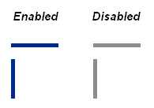

## KryptonBorderEdge

Use the *KryptonBorderEdge* control when you need to display a vertical or
horizontal graphic that has a border appearance. For example, you could place a
vertical *KryptonBorderEdge* instance inside a *KryptonGroup* in order to split
the group into two visual areas. Using this control would ensure the appearance
of the vertical graphic is consistent with the appearance of the *KryptonGroup*
border. They would have the same colors and thickness etc.

 

**Appearance** 

The *BorderStyle* property is used to define the styling required for the
appearance of the *KryptonBorderEdge* control. The default value of *Control -
Client* is the same as the default border style of the *KryptonGroup*. You can
alter this property to any of the many border style enumeration values so that
the appearance matches whatever control you are using.

 

You can use the *Orientation* property to specify either a vertical or
horizontal. By default the control has an *AutoSize* value of *True* that will
cause one of the control dimensions to be automatically calculated. When in the
vertical orientation the width is automatically calculated and when horizontal
the height is auto calculated. If you need to specify both the width and height
then set the *AutoSize* to be *False*. See figure 1 for examples of both
orientations.

*Figure 1 – Width = 5, Orientation = Horizontal + Vertical*

 

 

**Two States** 

Only two possible states of *Disabled* and *Normal* are used by the border edge
control. In order to customize the appearance use the corresponding
*StateDisabled* and *StateNormal* properties.   
 

To speed up the customization process an extra *StateCommon* property has been
provided. The settings from this are used if no override has been defined for
the state specific entry. Note that the specific state values always take
precedence and so if you define the border width in *StateNormal* and
*StateCommon* then the *StateNormal* value will be used whenever the control is
in the *Normal* state. Only if the *StateNormal* value is not overridden will it
look in *StateCommon*.

 

 

**Examples of Appearance** 

Figure 2 shows the appearance of the border edge for the *Control - Client*
style in the vertical and horizontal orientations. The left side shows the
controls enabled and the right side shows the disabled appearance.

*Figure 2 – Example appearance*  

