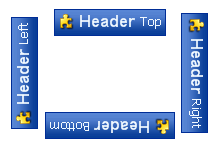

## KryptonHeader

Use the *KryptonHeader* control to create a heading that provides a description
for a section of your form. For example, you can place a header at the top of an
area of related controls and provide a name and description that indicates the
purpose of the related controls. The content of the control is contained in the
*Values* property. You can define *Heading*, *Description* and *Image* details
within the *Values* property.

 

**Appearance** 

The *HeaderStyle* property is used to define the top level styling required for
the appearance of the *KryptonHeader* control. The default value of *Primary*
gives a bold header style that should be appropriate for use as a section
header. Alternatively use the *Secondary* setting for less prominent text. See
figures 2 and 3 for examples of the visual difference. The *Form* style is used
for the caption area by the *KryptonForm* control. There are also custom styles
that can be defined via a *KryptonPalette* for situations where you need to
create variations on the styles already provided. Custom styles are named simply
*Custom1 and Custom2*.

You can use the *Orientation* property to rotate the control. The default
setting of *Top* shows the content in a left to right and top to bottom
arrangement. Specify *Bottom* to have the control displayed upside down, *Left*
to show the content rotated 90 degrees left and *Right* for 90 degrees rotated
right. See figure 1 for examples.

*Figure 1 – Orientation Property*

 

**Two States** 

Only two possible states of *Disabled* and *Normal* are used by the header
control. In order to customize the appearance use the corresponding
*StateDisabled* and *StateNormal* properties. Each of these properties allows
you to modify the background, border and content characteristics.

 

To speed up the customization process an extra *StateCommon* property has been
provided. The settings from this are used if no override has been defined for
the state specific entry. Note that the specific state values always take
precedence and so if you define the text font in *StateNormal* and *StateCommon*
then the *StateNormal* value will be used whenever the control is in the
*Normal* state. Only if the *StateNormal* value is not overridden will it look
in *StateCommon*.

 

**ButtonSpecs**  
You can add buttons to the header by modifying the *ButtonSpecs* collection
exposed by the *KryptonHeader*. Each *ButtonSpec* entry in the
collection describes a single button for display on the header. You can use the
*ButtonSpec* to control all aspects of the displayed button including
visibility, edge, image, text and more. At design time use the collection editor
for the *ButtonSpecs* property in order to modify the collection and modify
individual *ButtonSpec* instances. See the [ButtonSpec](buttonspec.md) section for
more details. Figure 2 shows an example of a *KryptonHeader* with buttons.

*Figure 2 – KryptonHeader with ButtonSpecs*

 

**AllowButtonSpecTooltips**  
By default the control will not show any tool tips when you hover the mouse over
the user defined button specifications. If you set this boolean property to
*True* then it will turn on tool tips for those button specs. Use the
*ButtonSpec.TooltipText* property in order to define the string you would like
to appear inside the displayed tool tip.  

**AllowButtonSpecTooltipPriority**
If the parent Item has tooltips, and the button spec has tooltips, then
the default is show both when hovering over the buttonspec. This can be disabled 
by setting `AllowButtonSpecTooltipPriority` to `true`, so that only 1 tooltip is
displayed when hovering over any part of the control.

**UseMnemonic**
When this property is defined as *True* for the *KryptonHeader* it will check
each of the *ButtonSpec* instances in the *ButtonSpecs* collection. If the
*Text* or *ExtraText* in a *ButtonSpec* matches the incoming mnemonic then the
*Click* event for the *ButtonSpec* will be fired.

 

**Examples of Appearance** 

Figure 3 shows the *KrytonHeader* in the *Normal* and *Disabled* states for the
*HeaderStyle* of *Primary. *The left column shows examples using the
*Professional - Office 2003* palette mode and the right column the *Professional
- System* palette mode. Figure 4 shows the same except where the *HeaderStyle*
has been changed to Secondary.  

*Figure 3 – HeaderStyle = Primary*

*Figure 4 – HeaderStyle = Secondary*
