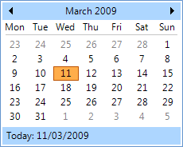
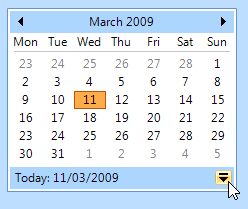

## KryptonMonthCalendar

The *KryptonMonthCalendar* control presents an intuitive graphical interface for
users to view and set date information. The control displays a grid containing
the numbered days of the month, arranged in columns underneath the days of the
week. You can select a different month by clicking the arrow buttons on either
side of the month caption. This control uses the *Krypton* palette to obtain
values for the drawing of the control.

 

**Appearance** 

The calendar displays with a border that contains a top and bottom caption with
the numbered days in the center as can be seen in figure 1. The top caption is
used to display the month and year of the date displayed along with arrows that
can be used to navigate forward and backward a month at a time. At the bottom is
a caption area that shows today's date which acts as a button so that pressing
the date will shift the selection to the date displayed. In the center are six
rows of days that display the possible days that can be selected. Note that days
that are not part of the month are shown in a disabled color.

*Figure 1 – Office 2007 Blue Palette*

 

  
**Seven States**

There are seven state properties that can be used to modify the appearance for
different elements of the control for the different possible display states. The
control background, control border and day heading elements can be customized by
using the *StateNormal* and *StateDisabled* set of properties. Individual
numbered days can be customized using all seven sets of properties
*StateNormal*, *StateDisabled*, *StateTracking*, *StatePressed*,
*StateCheckedNormal*, *StateCheckedTracking* and *StateCheckedPressed*. The
checked group of states are used for a day this is currently part of the
selection. Tracking and Pressed states represent when the mouse is hovering over
the day or when the left mouse button is pressed down for the day respectively.

 

To speed up the customization process an extra *StateCommon* property has been
provided. The settings from this are used if no override has been defined for
the state specific entry. Note that the specific state values always take
precedence and so if you define the border color in *StateNormal* and
*StateCommon* then the *StateNormal* value will be used whenever the control is
in the *Normal* state. Only if the *StateNormal* value is not overridden will it
look in *StateCommon.*

 

 

**Three Overrides**

Override properties are used when a particular condition has been met and are
used in preference to the State property that would normally be used. The
*OverrideFocus* values are used if the control currently has focus allows you to
specify how to modify the appearance of a numbered day when it has focus. By
default the focus override only alters the appearance so that a focus rectangle
is drawn around the numbered day so that the user can see that the control
currently has the focus.

 

The *OverrideBolded* is used for a numbered day that needs to be more prominent
because that day has been specified by the *AnnuallyBoldedDates*,
*MonthlyBoldedDates* or *BoldedDates* collection properties. As the name
suggests, by default a matching day will be shown in bold instead of the regular
font. But you can modify the *OverrideBolded* settings to change the feedback
and provide a different background or foreground color instead.

 

Finally the *OverrideToday* is used to alter the appearance of the day that is
defined as today's date. You can change *TodayDate* property if you need to
specify a particular date as today. By default the control will draw the border
of the numbered date that matches *TodayDate* in a different color. Figure 1
shows an example where the day has a dark red border color.

  
  
**ButtonSpecs**

Use this collection property to define any number of extra buttons that you
would like to appear at the near or far edges of the bottom caption. Figure 2
shows an example of a button specification that has been created to be
positioned at the *Far* edge with a button style of *ButtonSpec* and a button
type of *Context*. You could then use this button to show a context menu with
additional options relevant to the calendar. Other possible uses of button
specifications might be to indicate error conditions or to initiate the showing
of help information.

*Figure 2 – KryptonMonthCalendar with ButtonSpec definition*

 

 

**AllowButtonSpecTooltips**  
By default the control will not show any tool tips when you hover the mouse over
the user defined button specifications. If you set this boolean property to
*True* then it will turn on tool tips for those button specs. Use the
*ButtonSpec.TooltipText* property in order to define the string you would like
to appear inside the displayed tool tip.

 

  
**DataBinding**  
There are three properties that make good candidates for data binding against.
The first is called *SelectionRange* and is named the same as the property found
on the standard windows *MonthCalendar* control. Unfortunately this is hard to
use because it consists of two child values for the start and end of the range.
Instead we recommend that you actually bind against the *SelectionStart* and
*SelectionEnd* properties. These are both of type *DateTime* and are simple to
bind against.
